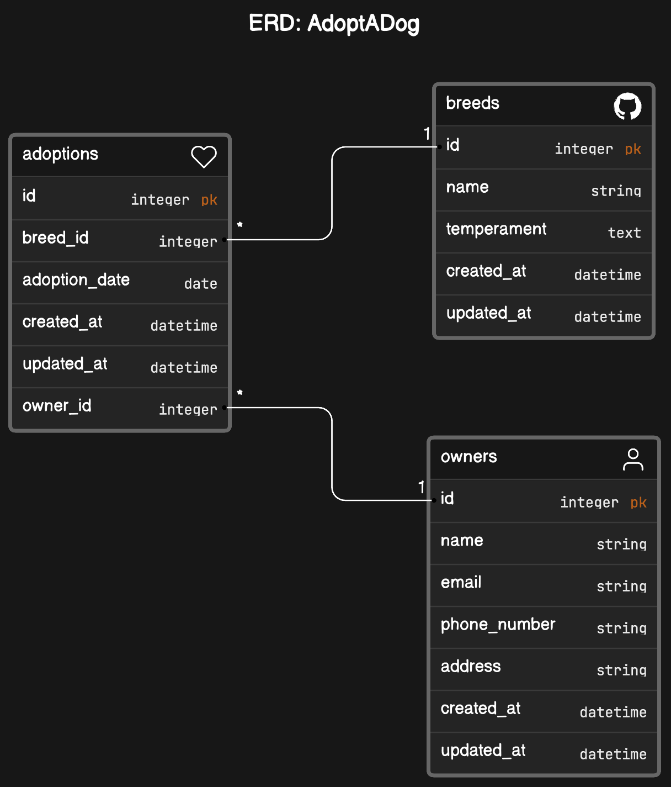

# AdoptADog Project

## Introduction

AdoptADog is a web application designed to streamline the dog adoption process. It serves as a platform where users can explore various dog breeds, learn about their unique characteristics, and find dogs available for adoption. The application also connects potential adopters with suitable pets and provides comprehensive information about the adoption process.

## Features

- **Browse Dog Breeds:** Users can browse a detailed list of dog breeds to understand their characteristics, temperament, and suitability as pets.
- **Detailed Breed Information:** Each breed page includes in-depth information about the breed's history, physical traits, and temperament.
- **Search Functionality:** Users can utilize both Simple and Hierarchical Search features to find specific dog breeds by name or other attributes.
- **User Information:** Detailed profiles are available for each user, including contact details and other relevant information.

## Technologies Used

The AdoptADog web application is built using the following technologies:

- **Ruby on Rails:** The backend framework responsible for web request handling and application logic.
- **Bootstrap:** The frontend framework used to create responsive and visually appealing user interfaces.

## Dataset Overview - AdoptADog

The dataset comprises three primary entities: Breeds, Owners, and Adoptions. These entities are interconnected through associations that accurately represent the relationships between pet breeds, their owners, and the adoptions that link them.

### Breeds

- **Description:** Represents various pet breeds, each with unique characteristics captured by attributes such as name and temperament.
- **Data Source:** [Dog CEO Dog API](https://dog.ceo/dog-api/).

### Owners

- **Description:** Represents individuals who adopt pets, storing their personal information, including contact details and address.
- **Data Source:** A CSV file named `owners.csv` located in the `db` folder.

### Adoptions

- **Description:** Records the adoption of pets by owners, serving as a join table between Breeds and Owners. It details which owner has adopted a pet of a specific breed and when the adoption occurred.
- **Data Source:** Generated data using the Faker gem.



## Setup Instructions

To set up the AdoptADog project locally, follow these steps:

- **Clone the Repository:**
   ```bash
   git clone <repository_url>


- **Navigate to the Project Directory:**

- cd Intro-To-Rails-Project-Shah

- **Install Dependencies:**

- bundle install

- **Set Up the Database:**

- rails db:migrate
- bundle exec rake import:owners
- rails db:seed

- **Start the Rails Server:**

- rails s

- **Access the Application:**
- Open your web browser and visit [http://localhost:3000](http://localhost:3000)
  to access the AdoptADog application.
